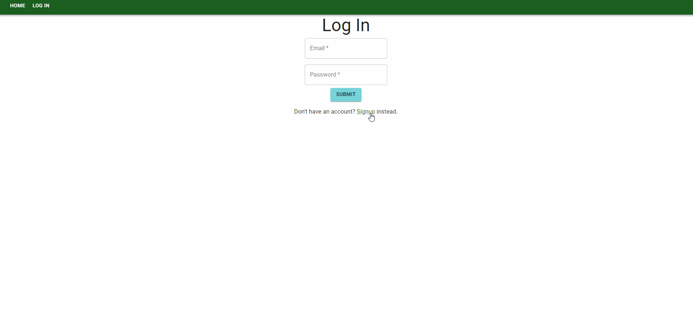

# project-3

## Description

Cinegraph is React based data visualization and modeling application which accepts queries from users to chart relational data about movies. Users can sign up and log in to the application to search for and save movie queries which are stored on a cloud database.

## Deployment

The website is deployed on [Heroku](https://movie-data-model.herokuapp.com/)

## Contributors

-   [Jessica Guico](https://github.com/jessicamcg)

-   [Nick Margaritondo](https://github.com/Nickm615)

-   [Jason Xie](https://github.com/jasonluxie)

## Demonstration

### API

-   [OMDb](http://www.omdbapi.com/)

### Framework & Components

-   [MUI](https://mui.com/)

## Further Development

### Dashboard

-   Display movie poster when querying for movies
-   See only movies for each individual user

### Signup

-   OAuth
